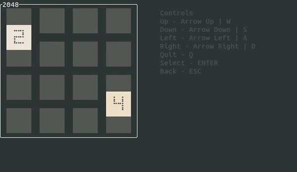

# rust2048

<p align="center">
    
</p>

`rust2048` is an animated "2048" type game working in terminal and written in rust.

This project is based on:
- [crossterm](https://github.com/crossterm-rs/crossterm)
- [tui-rs](https://github.com/fdehau/tui-rs)

### Demo

The demo shown in the gif can be run by following these steps.

```
# clone the repo
git clone https://github.com/xsphrx/rust2048 && cd rust2048
# install dependencies
cargo build
# run the game
cargo run
```